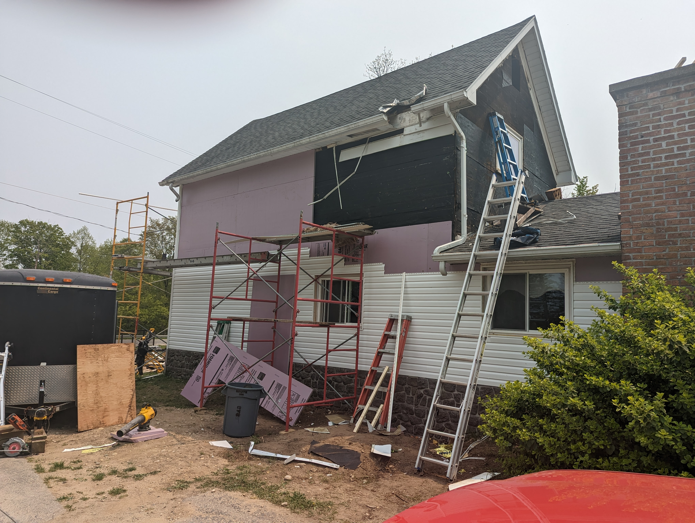
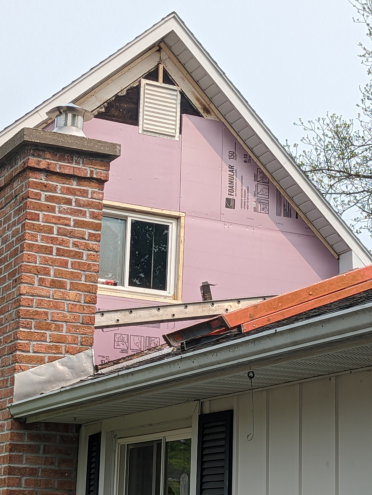

******************************************************
Energy upgrades
******************************************************

I lived in Alaska for 30 years and built many homes as a general contractor. I've only built super-insulated homes during those yeras, and I brought that ethic to Michigan.

Foundation
===================

* I excavated around the perimeter of the house to a depth of 2' and insulated with 3 to 4 inches of EPS foam which I took up past the bottom sill plate 12-20 inches. 
* Inspected the stud cavities and fix any issues while at the same time eliminating any drafts at the lower levels of the house. 
* I also sprayed 1200 board feet of polyurethane R7 foam on the inside of the exposed block walls in both crawl spaces. This further sealed the foundation from the footing to the top of the rim board. Pretty tight. The R value in these areas exceeds what you'll find on most new homes. 

Roof
==================

 I blew 16+ inches of cellulose into the lower roof and high roof attic spaces. With the existing insulation, that space is likely R70 or more.

Walls and windows
=============================

The walls, of course, are 2x4. So in 2023, I spent 50k on energy and siding upgrades: 

* Removed all of the siding. 
* Installed 2" of EPS pink foam (R10): Every joint and seam was caulked with silicone. Every crack, hole, and window install was foamed and sealed. 
* Replaced all fixed windows with TRIPLE pane low e glass with a 5/8" airspace (Alaska style). 
* Inspected for rot (almost none), and sealed everything up tight. 
* Re-sided with new vinyl siding and caulked again. The main item that could be improved at this point is to replace the opener windows (1 per room). 

    
Mechanical
======================

* Removed the old boiler. The baseboard remains and there are new zone valves installed, so if you're not into the 21st century, you can always go back. 
* Installed 3 energy efficience heat pump mini-splits.
* Mini splits also provide aircondition throughtout the house in the summer. 
* Installed 2 new 50 gallon hybrid heat pump hot water heaters:  1 for the main house and one for the mother-in-law apartment. 
* Installed a basement fan on a humidistat for 3 season ventilation. This isn't really needed because the to hybrid hot water heaters dehumidify the air and keep the basement cool. It could be used to circulate fresh air and pump in warm air in the summer if desired. 

